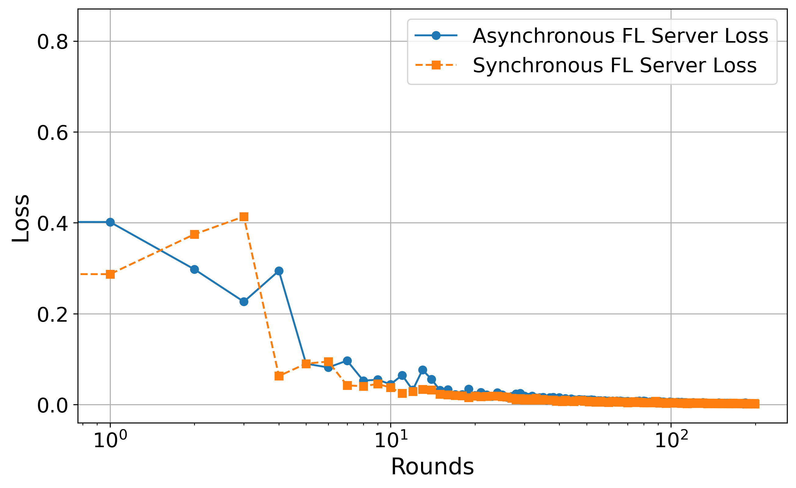
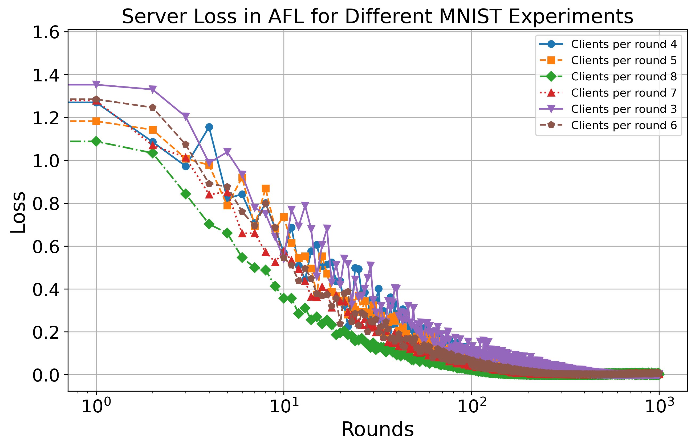

# Asynchronous Federated Learning with non-convex client objective functions and heterogeneous dataset

This repository implements **asynchronous federated learning** using **pure PyTorch**, training **CNN and ResNet models** on **MNIST and CIFAR-10** datasets. The implementation does **not** use external federated learning frameworks like Flower or PySyft, instead leveraging **asyncio** for asynchronous client updates.

## Features

- **General & Configurable Framework**:
  - The number of clients, local epochs, number of rounds, clients per round, batch size, and other parameters can be easily set as inputs.
  - Works with **any image classification dataset** that can be loaded using PyTorch's `torchvision.datasets`.
- **Asynchronous Federated Learning**: Clients train asynchronously with simulated network delays.
- **Support for MNIST & CIFAR-10**:
  - **MNIST**: CNN-based classifier.
  - **CIFAR-10**: ResNet-based classifier.
- **Non-IID Data Partitioning**: Uses **Dirichlet distribution** for imbalanced data distribution among clients.
- **Delay-Aware Learning Rate**: Adjusts learning rate based on client delays.
- **Early Stopping**: Clients stop training if loss does not improve for a given number of epochs.
- **Loss Tracking & Visualization**: Saves and plots client/server training loss over rounds.
- **Client Selection Tracking**: Saves and visualizes selected clients per round.
- **Execution Time Analysis**: Logs and saves execution times for each client per round.

## Requirements

- Python 3.x
- PyTorch
- torchvision
- numpy
- matplotlib
- tqdm
- asyncio
- nest_asyncio

You can install dependencies using:

```bash
pip install torch torchvision numpy matplotlib tqdm nest_asyncio
```

## Running the Code

To start federated learning on **MNIST**:

```bash
python async_fdl_mnist_delay_track_lr_non_iid.py
```

To start federated learning on **CIFAR-10**:

```bash
python async_fdl_cifar_delay_track_lr_non_iid.py
```

### Configurable Parameters:

| Parameter | Description | Example |
|-----------|------------|---------|
| `--num_clients` | Number of participating clients | `10` |
| `--num_rounds` | Number of federated learning rounds | `1000` |
| `--local_epochs` | Local training epochs per client | `10` |
| `--clients_per_round` | Number of clients selected per round | `5` |
| `--batch_size` | Training batch size | `64` |
| `--alpha` | Dirichlet distribution parameter for non-IID partitioning | `0.5` |
| `--gamma_0` | Initial learning rate | `1e-3` |
| `--alpha_lr` | Adjustment factor for delay-aware learning rate | `0.01` |
| `--delay_t` | Maximum simulated network delay (seconds) | `2` |
| `--early_stopping` | Number of epochs before stopping training early | `10` |

This makes the implementation **flexible** and **adaptable** to different datasets, models, and training settings.

## Project Structure

```
.
├── data/                   # Directory for downloading datasets
├── results/                # Directory for saving training results
│   ├── mnist_clients_*/    # MNIST results
│   ├── cifar_clients_*/    # CIFAR-10 results
│   ├── client_X_losses.npy # Training loss per client
│   ├── server_losses.npy   # Training loss per round at server
│   ├── execution_times.csv # Execution time per client per round
│   ├── selected_clients.csv# Selected clients per round
│   ├── plots/              # Saved loss and client selection plots
│
├── mnist_main.py           # MNIST federated learning script
├── cifar_main.py           # CIFAR-10 federated learning script
├── model_mnist.py          # CNN Model for MNIST
├── model_cifar.py          # ResNet Model for CIFAR-10
├── utils.py                # Utility functions for saving/loading data
├── README.md               # This file
```

## Dataset & Model Details

### **MNIST**
- **Model:** CNN with multiple convolutional layers.
- **Default Settings**:
  - **Number of Clients:** 10
  - **Rounds:** 1000
  - **Local Epochs:** 10
  - **Clients per Round:** 5
  - **Batch Size:** 64

### **CIFAR-10**
- **Model:** ResNet with Basic Blocks.
- **Default Settings**:
  - **Number of Clients:** 10
  - **Rounds:** 200
  - **Local Epochs:** 10
  - **Clients per Round:** 6
  - **Batch Size:** 64

## Results & Visualization

Once training is complete, results will be saved in the `results/` directory.

- **Client Training Losses:** Saved as `.npy` files and plotted per client.
- **Server Loss Across Rounds:** Saved as `.npy` and plotted.
- **Selected Clients Per Round:** Logged in `selected_clients.csv` and visualized in `selected_clients_plot.png`.
- **Execution Times:** Logged in `execution_times.csv`.

### Example Training Loss Plot (MNIST & CIFAR-10):




## Extending the Code

Since the code is **general**, it can be extended to **other datasets and models**:
1. **Change the dataset**:
   - Replace `datasets.MNIST` or `datasets.CIFAR10` with any PyTorch-supported dataset (e.g., `datasets.FashionMNIST`, `datasets.CIFAR100`).
2. **Modify the model**:
   - Update `model_mnist.py` or `model_cifar.py` to define a new architecture (e.g., MobileNet, Transformer-based models).
3. **Tune hyperparameters**:
   - Adjust **learning rate, batch size, local epochs, client selection strategy**, etc.
4. **Implement secure aggregation**:
   - Add **differential privacy** or **secure aggregation** for enhanced security.

## Future Improvements

- Expand to **other datasets** beyond MNIST & CIFAR-10.


## Citation

If you use this repository in your research, please cite it:

```
To be provided soon
```

## Contact

```
Please feel free to contact us: `aliforootani@ieee.org`; `aliforootani@gmail.com`; `forootani@mpi-magdeburg.mpg.de`; `ali.forootani@ufz.de`
```

## License

This project is licensed under the MIT License. See the `LICENSE` file for details.

